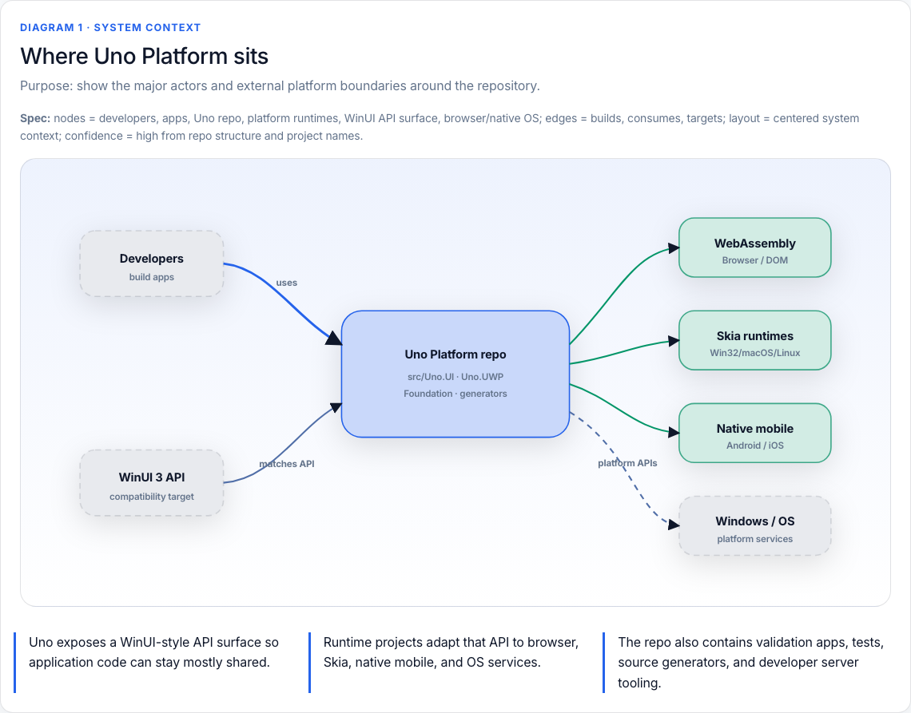

# visualize-html

A simple, content-first HTML visualization skill for quickly understanding any codebase.

This repository contains the `visualize` skill: a small instruction set for turning ideas, reports, datasets, plans, and codebases into a single self-contained HTML file.

The goal is not to generate flashy UI. The goal is to help a reader understand something faster through clear structure, readable diagrams, and concise explanation.

## Design goals

- **Simple UI by default** — use the Bootstrap CDN skeleton instead of large custom styling.
- **Content over decoration** — spend tokens on the explanation, structure, and diagrams.
- **Semantic-first diagrams** — define purpose, nodes, edges, layout, visual grammar, and confidence before drawing.
- **Inline SVG/CSS for architecture diagrams** — deterministic, reviewable, and less fragile than Mermaid for agent-generated HTML.
- **Chunked generation** — large visualizations are written section by section, with `Chunk N = Diagram N`, so interrupted generation can be recovered.
- **Single-file output** — generated visualizations stay portable: inline CSS, inline JavaScript, and CDN-only libraries when needed.

## Installation

Install with the open agent skills CLI from [`vercel-labs/skills`](https://github.com/vercel-labs/skills):

```bash
npx skills add sting8k/visualize-html
```

Install globally for Droid:

```bash
npx skills add sting8k/visualize-html -g -a droid -y
```

Install globally for Pi:

```bash
npx skills add sting8k/visualize-html -g -a pi -y
```

Install for a project instead of globally by running the command from the project root and omitting `-g`.

```bash
npx skills add sting8k/visualize-html -a droid -y
```

## Skill flow

The skill is designed to follow this loop:

1. **Choose the visualization type** from the user's intent.
2. **Read only the needed references** from `references/`.
3. **Start from `references/skeleton.md`** for the base HTML shell.
4. **For large or multi-diagram output, use chunked writing** from `references/generation-protocol.md`.
5. **For diagrams, write the semantic spec first** before rendering SVG/CSS.
6. **Apply diagram quality gates** from `references/diagram-quality.md`.
7. **Verify the HTML** for required structure, theme support, accessibility, and diagram readability.
8. **Open the file and return the path/URL**.

## Repository structure

```text
.
├── SKILL.md
├── LICENSE
├── README.md
└── references/
    ├── skeleton.md              # Bootstrap-based HTML skeleton
    ├── generation-protocol.md   # Chunked writing + semantic-first diagram rules
    ├── diagram-quality.md       # Diagram review gates
    ├── codebase-svg.md          # Codebase/architecture diagram patterns
    ├── types.md                 # Visualization type patterns
    ├── libraries.md             # CDN library guidance
    └── ...
```

## Key references

- `SKILL.md` — main contract and workflow.
- `references/skeleton.md` — mandatory Bootstrap-based HTML base.
- `references/generation-protocol.md` — write long files in chunks; use `Chunk N = Diagram N`.
- `references/diagram-quality.md` — checks for purpose, labels, edges, legend, accessibility, and confidence.
- `references/codebase-svg.md` — layered inline SVG/CSS patterns for repositories and architecture maps.

## Example output



- [Uno Platform architecture bilingual visualization]([examples/uno-platform-architecture-bilingual.html](https://refined-github-html-preview.kidonng.workers.dev/sting8k/visualize-html/raw/refs/heads/master/examples/uno-platform-architecture-bilingual.html)) - Visualize HTML of <https://github.com/unoplatform/uno>.

## Attribution

This skill is adapted from the original visualize skill:

https://github.com/careerhackeralex/visualize
